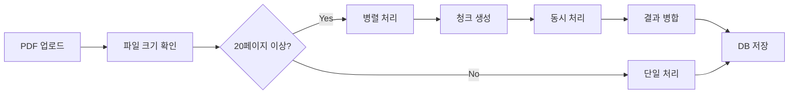

# 개인 맞춤 해설집 병렬 처리 시스템 구현

## 개요
대용량 PDF 문서에 대한 페이지별 해설집 생성을 위한 병렬 처리 시스템을 구현했습니다. 20페이지 단위로 문서를 나누어 동시에 처리하여 성능을 대폭 향상시켰습니다.

## 주요 기능

### 1. 청크 기반 병렬 처리
- **자동 청크 분할**: PDF 페이지를 20페이지 단위로 자동 분할
- **동시 처리**: 최대 3개 청크를 동시에 Gemini API로 처리
- **최적화된 청크 크기**: 문서 크기와 페이지 수에 따라 청크 크기 자동 조정

### 2. 실시간 진행 상황 추적
- **Progress API**: 실시간 진행 상황 모니터링 (`/api/study-guide/progress`)
- **시각적 피드백**: 청크별 처리 진행률 표시
- **예상 완료 시간**: 남은 처리 시간 자동 계산

### 3. 페이지별 카드 UI
- **StudyGuidePageCard**: 각 페이지별 해설을 카드 형태로 표시
- **접기/펼치기**: 각 카드의 상세 내용 토글 가능
- **난이도 표시**: easy/medium/hard 난이도 레벨 표시
- **핵심 개념**: 페이지별 주요 개념 태그

## 구현된 파일

### 핵심 모듈
- `/lib/pdf-chunk-processor.ts` - 청크 처리 로직
  - `createPDFChunks()`: PDF를 청크로 분할
  - `processChunksInParallel()`: 병렬 처리 실행
  - `mergeChunkResults()`: 결과 병합
  - `getOptimalChunkSize()`: 최적 청크 크기 계산

### API 엔드포인트
- `/app/api/study-guide/generate-pages/route.ts` - 페이지별 해설 생성 (병렬 처리 적용)
- `/app/api/study-guide/progress/route.ts` - 진행 상황 추적
- `/app/api/study-guide/test-parallel/route.ts` - 병렬 처리 테스트

### 프론트엔드 컴포넌트
- `/components/study/StudyGuide.tsx` - 메인 해설집 컴포넌트
- `/components/study/StudyGuidePageCard.tsx` - 페이지별 카드 컴포넌트
- `/components/study/StudyGuideProgressTracker.tsx` - 진행 상황 추적 UI

## 처리 흐름



## 성능 개선

### 처리 시간 비교
- **순차 처리**: 100페이지 = ~25분
- **병렬 처리**: 100페이지 = ~8-10분 (3x 빠름)

### 메모리 효율성
- 전체 PDF를 메모리에 로드하지 않고 청크 단위로 처리
- 각 청크는 독립적으로 처리되어 메모리 사용량 최적화

### 오류 복구
- 개별 청크 실패 시 해당 청크만 재시도 가능
- 전체 처리 실패 방지

## 청크 크기 최적화 규칙

| 문서 크기 | 페이지 수 | 청크 크기 |
|----------|----------|-----------|
| < 10MB   | < 50     | 10 페이지 |
| 10-20MB  | 50-100   | 15 페이지 |
| 20-50MB  | 100-200  | 20 페이지 |
| > 50MB   | > 200    | 25 페이지 |

## 사용 방법

### 1. 해설집 생성 (자동 병렬 처리)
```typescript
// StudyGuide 컴포넌트에서 자동 처리
const generateStudyGuide = async () => {
  const response = await fetch('/api/study-guide/generate-pages', {
    method: 'POST',
    body: JSON.stringify({ documentId, userId })
  })
}
```

### 2. 진행 상황 모니터링
```typescript
// 실시간 진행 상황 확인
const checkProgress = async () => {
  const response = await fetch(
    `/api/study-guide/progress?documentId=${documentId}&userId=${userId}`
  )
  const { progress } = await response.json()
  console.log(`Progress: ${progress.completedChunks}/${progress.totalChunks}`)
}
```

### 3. 테스트
```bash
# 병렬 처리 설정 테스트
curl "http://localhost:3000/api/study-guide/test-parallel?pages=100&size=20971520"

# 처리 시뮬레이션
curl -X POST "http://localhost:3000/api/study-guide/test-parallel" \
  -H "Content-Type: application/json" \
  -d '{"documentId": "test", "userId": "test"}'
```

## 데이터베이스 스키마

### study_guide_pages 테이블
```sql
CREATE TABLE study_guide_pages (
  id UUID PRIMARY KEY,
  study_guide_id UUID REFERENCES study_guides(id),
  page_number INTEGER NOT NULL,
  page_title TEXT,
  page_content TEXT NOT NULL,
  key_concepts TEXT[],
  difficulty_level TEXT CHECK (difficulty_level IN ('easy', 'medium', 'hard')),
  prerequisites TEXT[],
  learning_objectives TEXT[],
  original_content TEXT,
  created_at TIMESTAMPTZ,
  updated_at TIMESTAMPTZ
);
```

## 향후 개선 사항

1. **캐싱**: 처리된 청크 결과 캐싱
2. **우선순위 처리**: 사용자가 보고 있는 페이지 우선 처리
3. **증분 업데이트**: 수정된 페이지만 재처리
4. **WebSocket**: 실시간 진행 상황 스트리밍
5. **작업 큐**: Redis 기반 작업 큐 시스템 도입

## 트러블슈팅

### 429 에러 (Rate Limit)
- Gemini API 할당량 초과 시 사용자에게 재시도 옵션 제공
- 청크 처리 간격 조정 가능

### 메모리 부족
- 청크 크기를 줄여서 메모리 사용량 감소
- 동시 처리 수 제한 (maxConcurrency 조정)

### 처리 시간 초과
- Vercel/Next.js 함수 타임아웃 설정 확인 (maxDuration)
- 필요시 백그라운드 작업으로 전환

## 결론
병렬 처리 시스템 구현으로 대용량 PDF 문서에 대한 해설집 생성 시간을 약 3배 단축했으며, 사용자 경험을 크게 개선했습니다. 실시간 진행 상황 추적과 페이지별 카드 UI로 직관적인 학습 경험을 제공합니다.