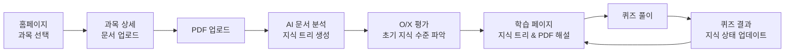
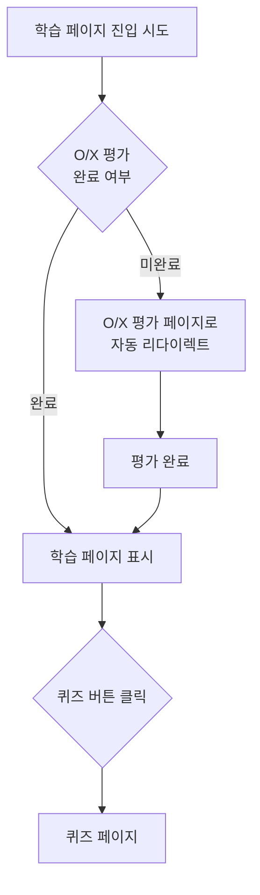
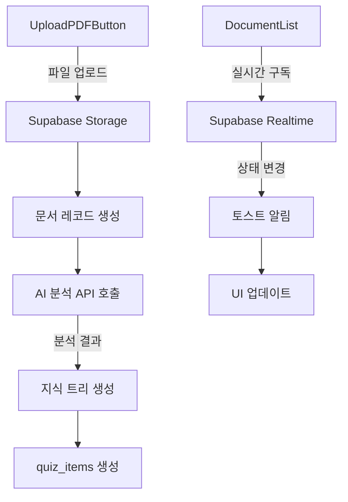
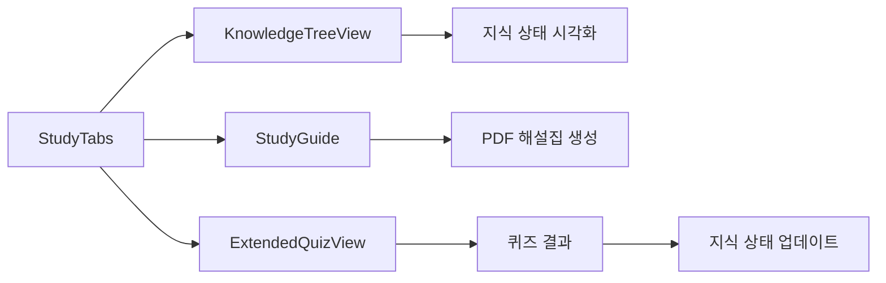

# AI PDF 학습 서비스 화면 정의 및 연결 구조 분석 보고서

## 목차
1. [프로젝트 개요](#1-프로젝트-개요)
2. [화면 구조 및 연결 관계](#2-화면-구조-및-연결-관계)
3. [각 화면 상세 정의](#3-각-화면-상세-정의)
4. [주요 컴포넌트 연결 관계](#4-주요-컴포넌트-연결-관계)
5. [네비게이션 패턴](#5-네비게이션-패턴)
6. [상태 관리 및 데이터 흐름](#6-상태-관리-및-데이터-흐름)
7. [UI/UX 특징](#7-uiux-특징)
8. [개선 제안](#8-개선-제안)

## 1. 프로젝트 개요

### 1.1 서비스 소개
AI PDF 학습 서비스는 사용자가 PDF 문서를 업로드하면 AI가 자동으로 분석하여 지식 트리를 생성하고, 개인화된 학습 경로를 제공하는 혁신적인 학습 플랫폼입니다.

### 1.2 기술 스택
- **Frontend Framework**: Next.js 15.3.5 (App Router), React 19.0.0
- **Type System**: TypeScript 5
- **Styling**: Tailwind CSS 4
- **Database**: Supabase (PostgreSQL + Realtime)
- **AI Integration**: Google Generative AI (Gemini)
- **PDF Processing**: react-pdf, pdfjs-dist
- **Additional Libraries**:
  - Mermaid (다이어그램 렌더링)
  - ReactFlow (플로우차트)
  - Lucide-react (아이콘 시스템)
  - React Hot Toast (알림 시스템)

### 1.3 핵심 기능
1. **PDF 문서 업로드 및 AI 분석**: 사용자가 업로드한 PDF를 AI가 분석하여 구조화된 지식을 추출
2. **지식 트리 자동 생성**: 문서 내용을 계층적 지식 구조로 변환
3. **개인화된 학습 경로**: 사용자의 현재 지식 수준에 맞춘 맞춤형 학습 제공
4. **다양한 유형의 퀴즈**: 객관식, O/X, 단답형 등 다양한 문제 유형 제공
5. **실시간 학습 진도 추적**: 학습 상태를 실시간으로 업데이트하고 시각화

## 2. 화면 구조 및 연결 관계

### 2.1 페이지 계층 구조
```
/ (홈페이지 - 과목 목록)
├── /subjects/[id] (과목 상세 - 문서 관리)
│   ├── /study (학습 메인 페이지)
│   │   └── /assessment (O/X 지식 평가)
│   └── /quiz (퀴즈 페이지)
│       └── /result (퀴즈 결과)
```

### 2.2 주요 사용자 플로우

#### 2.2.1 기본 학습 플로우


#### 2.2.2 조건부 네비게이션 플로우


## 3. 각 화면 상세 정의

### 3.1 홈페이지 (/) - 과목 목록

#### 화면 구성
```
┌─────────────────────────────────────────────────┐
│  내 과목                              [새 과목 추가] │
│  AI와 함께하는 스마트 학습 여정                      │
├─────────────────────────────────────────────────┤
│  ┌─────────┐  ┌─────────┐  ┌─────────┐         │
│  │ 과목 1   │  │ 과목 2   │  │ 과목 3   │         │
│  │         │  │         │  │         │         │
│  │ 2개 문서 │  │ 5개 문서 │  │ 1개 문서 │         │
│  └─────────┘  └─────────┘  └─────────┘         │
│                                                 │
│  ┌─────────┐  ┌─────────┐  ┌─────────┐         │
│  │ 과목 4   │  │ 과목 5   │  │ 과목 6   │         │
│  │         │  │         │  │         │         │
│  │ 3개 문서 │  │ 0개 문서 │  │ 2개 문서 │         │
│  └─────────┘  └─────────┘  └─────────┘         │
└─────────────────────────────────────────────────┘
```

#### 주요 기능
- **과목 카드 표시**: 3열 그리드 레이아웃으로 과목 카드 배열
- **과목 생성**: "새 과목 추가" 버튼으로 모달 팝업을 통한 과목 생성
- **과목 삭제**: 각 카드의 삭제 버튼으로 과목 제거
- **과목 이동**: 카드 클릭 시 해당 과목 상세 페이지로 이동

#### 사용 컴포넌트
- `SubjectList`: 과목 카드 목록 렌더링
- `CreateSubjectButton`: 과목 생성 모달
- `SubjectListSkeleton`: 로딩 상태 표시

### 3.2 과목 상세 페이지 (/subjects/[id])

#### 화면 구성
```
┌─────────────────────────────────────────────────┐
│  ← 과목 목록으로                                  │
│  [과목명]                                        │
│  [과목 설명]                                     │
├─────────────────────────────────────────────────┤
│  ┌─────────────────────┬───────────────────┐   │
│  │                     │   학습 통계         │   │
│  │    📄 PDF 업로드     │   총 문서: 3개      │   │
│  │                     │   진행률: 67%      │   │
│  │  [파일 선택하기]     ├───────────────────┤   │
│  │                     │   💡 학습 팁        │   │
│  ├─────────────────────┤   • PDF 분석 중... │   │
│  │  문서 목록           │   • 지식 평가 먼저   │   │
│  │  ┌─────────────┐    │                   │   │
│  │  │ 문서1.pdf   │    │                   │   │
│  │  │ ✓ 완료      │    │                   │   │
│  │  │ [학습하기]  │    │                   │   │
│  │  └─────────────┘    │                   │   │
│  └─────────────────────┴───────────────────┘   │
└─────────────────────────────────────────────────┘
```

#### 주요 기능
- **PDF 업로드**: 
  - 최대 50MB 파일 크기 제한
  - PDF 형식만 허용
  - 업로드 후 자동 AI 분석 시작
- **문서 상태 관리**:
  - `pending`: 대기 중 (노란색)
  - `processing`: 분석 중 (파란색, 회전 아이콘)
  - `completed`: 완료 (녹색, 체크 아이콘)
  - `failed`: 실패 (빨간색, X 아이콘)
- **실시간 업데이트**: Supabase Realtime으로 문서 상태 변경 감지
- **문서 삭제**: 각 문서별 삭제 기능

#### 사용 컴포넌트
- `UploadPDFButton`: PDF 업로드 처리
- `DocumentList`: 문서 목록 관리
- `DocumentStatus`: 상태 표시
- `DeleteDocumentButton`: 문서 삭제

### 3.3 O/X 지식 평가 페이지 (/subjects/[id]/study/assessment)

#### 화면 구성
```
┌─────────────────────────────────────────────────┐
│  학습 전 지식 평가                                │
│  간단한 O/X 퀴즈로 현재 지식 수준을 파악합니다      │
├─────────────────────────────────────────────────┤
│  진행률: ████████░░░░░░░░ 8/15                   │
│                                                 │
│  ┌─────────────────────────────────────────┐   │
│  │                                         │   │
│  │  Q. React의 useState는 함수형           │   │
│  │     컴포넌트에서만 사용할 수 있다?        │   │
│  │                                         │   │
│  │     [ O ]           [ X ]               │   │
│  │                                         │   │
│  └─────────────────────────────────────────┘   │
│                                                 │
│  건너뛴 개념: useEffect, useContext...           │
└─────────────────────────────────────────────────┘
```

#### 주요 기능
- **의존성 기반 평가**:
  - 선수 지식이 필요한 개념은 자동으로 건너뜀
  - 상위 개념 오답 시 하위 개념 자동 'unknown' 처리
- **점진적 지식 수준 업데이트**:
  - 정답: understanding_level +20
  - 오답: understanding_level -20
- **진행률 표시**: 전체 문제 중 현재 진행 상황 표시
- **건너뛴 개념 미리보기**: 자동으로 건너뛴 하위 개념들 표시

#### 평가 완료 조건
- 모든 지식 노드에 대한 평가 완료
- 또는 의존성에 의해 남은 모든 노드가 자동 처리됨

### 3.4 학습 페이지 (/subjects/[id]/study)

#### 화면 구성
```
┌─────────────────────────────────────────────────┐
│  ← 문서 목록으로          [과목명] - [문서명]      │
├─────────────────────────────────────────────────┤
│  ┌─────────────────┬─────────────────────────┐ │
│  │                 │  [지식 트리] [PDF 해설집]  │ │
│  │                 ├─────────────────────────┤ │
│  │                 │  📊 지식 트리              │ │
│  │   PDF Viewer    │  ├─ React 기초 ✓         │ │
│  │                 │  │  ├─ JSX ✓             │ │
│  │   [페이지 표시]  │  │  └─ 컴포넌트 ✗        │ │
│  │                 │  ├─ Hooks ✗              │ │
│  │                 │  │  ├─ useState ✗        │ │
│  │                 │  │  └─ useEffect ✗       │ │
│  │                 ├─────────────────────────┤ │
│  │                 │  [문제풀고 지식트리 완성]   │ │
│  └─────────────────┴─────────────────────────┘ │
└─────────────────────────────────────────────────┘
```

#### 주요 기능
- **분할 화면 레이아웃**:
  - 좌측 50%: PDF 원본 문서 표시
  - 우측 50%: 학습 도구 (탭 형식)
- **탭 네비게이션**:
  - 지식 트리 탭: 현재 지식 상태 시각화
  - PDF 해설집 탭: AI 생성 맞춤형 학습 가이드
- **조건부 접근**:
  - O/X 평가 미완료 시 자동으로 평가 페이지로 리다이렉트
  - 평가 완료 후에만 학습 콘텐츠 접근 가능

#### 사용 컴포넌트
- `PDFViewer`: PDF 문서 렌더링
- `StudyTabs`: 탭 전환 관리
- `KnowledgeTreeView`: 지식 트리 시각화
- `StudyGuide`: AI 생성 학습 가이드

### 3.5 퀴즈 페이지 (/subjects/[id]/quiz)

#### 화면 구성
```
┌─────────────────────────────────────────────────┐
│  ← 학습으로 돌아가기      [과목명] - [문서명]      │
├─────────────────────────────────────────────────┤
│  연습문제 (15문제)              진행률: 3/15      │
│                                                 │
│  ┌─────────────────────────────────────────┐   │
│  │ 문제 3. [객관식] [중급]                   │   │
│  │                                         │   │
│  │ React에서 상태 관리를 위한 Hook은?        │   │
│  │                                         │   │
│  │ ○ useStatus                            │   │
│  │ ● useState                             │   │
│  │ ○ useCondition                         │   │
│  │ ○ useVariable                          │   │
│  │                                         │   │
│  │ [제출하기]                              │   │
│  └─────────────────────────────────────────┘   │
└─────────────────────────────────────────────────┘
```

#### 문제 유형
1. **객관식** (multiple_choice): 4개 선택지 중 1개 선택
2. **O/X** (true_false): 참/거짓 판단
3. **단답형** (short_answer): 짧은 텍스트 입력
4. **빈칸 채우기** (fill_in_blank): 문장 내 빈칸 완성
5. **매칭** (matching): 좌우 항목 연결

#### 평가 시스템
- **정답 처리**:
  - understanding_level +20 (최대 100)
  - 정답 표시 및 해설 제공
- **오답 처리**:
  - understanding_level -30 (최소 0)
  - 오답 노트에 기록
  - 정답 및 해설 표시

#### 사용 컴포넌트
- `ExtendedQuizView`: 전체 퀴즈 관리
- `MultipleChoiceQuestion`: 객관식 문제
- `TrueFalseQuestion`: O/X 문제
- `ShortAnswerQuestion`: 단답형 문제
- `FillInBlankQuestion`: 빈칸 채우기
- `MatchingQuestion`: 매칭 문제

### 3.6 퀴즈 결과 페이지 (/subjects/[id]/quiz/result)

#### 화면 구성
```
┌─────────────────────────────────────────────────┐
│  🎉 퀴즈 완료!                                    │
│  학습 성과를 확인하세요                            │
├─────────────────────────────────────────────────┤
│  ┌───────────┬───────────┬───────────┐         │
│  │ 문제 점수  │ 지식트리   │ 개선된    │         │
│  │   80%     │   85%     │  +5개    │         │
│  │ 12/15 정답 │  완성도    │  개념     │         │
│  └───────────┴───────────┴───────────┘         │
│                                                 │
│  업데이트된 지식 트리                             │
│  ├─ React 기초 ✓ (100%)                         │
│  │  ├─ JSX ✓ (100%)                            │
│  │  └─ 컴포넌트 ✓ (80%)                         │
│  ├─ Hooks ✓ (75%)                              │
│  │  ├─ useState ✓ (90%)                        │
│  │  └─ useEffect ✓ (60%)                       │
│                                                 │
│  [학습 페이지로 돌아가기]  [다시 풀어보기]         │
└─────────────────────────────────────────────────┘
```

#### 주요 기능
- **성과 통계 표시**:
  - 정답률 계산 및 표시
  - 지식 트리 완성도 계산
  - 새롭게 학습한 개념 수 표시
- **지식 상태 시각화**:
  - 업데이트된 지식 트리 표시
  - 각 노드의 understanding_level 표시
- **후속 액션**:
  - 학습 페이지로 복귀
  - 퀴즈 재도전

## 4. 주요 컴포넌트 연결 관계

### 4.1 문서 처리 플로우


### 4.2 학습 플로우


### 4.3 컴포넌트 의존성 관계
```
App
├── Layout (전역 레이아웃)
│   └── ToastProvider (알림 시스템)
├── Pages
│   ├── HomePage
│   │   ├── SubjectList
│   │   └── CreateSubjectButton
│   ├── SubjectDetailPage
│   │   ├── UploadPDFButton
│   │   └── DocumentList
│   │       └── DocumentStatus
│   ├── AssessmentPage
│   │   └── OXKnowledgeAssessment
│   ├── StudyPage
│   │   ├── PDFViewer
│   │   └── StudyTabs
│   │       ├── KnowledgeTreeView
│   │       └── StudyGuide
│   ├── QuizPage
│   │   └── ExtendedQuizView
│   │       ├── MultipleChoiceQuestion
│   │       ├── TrueFalseQuestion
│   │       └── [기타 문제 유형]
│   └── QuizResultPage
│       └── KnowledgeTreeView
```

## 5. 네비게이션 패턴

### 5.1 네비게이션 방식별 사용 사례

#### Next.js Link 컴포넌트
```typescript
// 정적 라우팅에 사용
<Link href={`/subjects/${subjectId}`}>
  <ArrowLeft /> 뒤로가기
</Link>
```
**사용 위치**:
- 뒤로가기 버튼
- 과목 카드 클릭
- 메뉴 이동

#### useRouter Hook
```typescript
// 동적/조건부 라우팅에 사용
const router = useRouter();
router.push(`/subjects/${subjectId}/quiz/result`);
```
**사용 위치**:
- 퀴즈 완료 후 결과 페이지 이동
- 조건부 리다이렉션
- 프로그래매틱 네비게이션

#### redirect 함수
```typescript
// 서버 컴포넌트에서 사용
import { redirect } from 'next/navigation';
redirect(`/subjects/${subjectId}/study/assessment`);
```
**사용 위치**:
- O/X 평가 미완료 시 리다이렉트
- 문서 미선택 시 첫 번째 문서로 이동

### 5.2 조건부 네비게이션 로직

#### O/X 평가 완료 체크
```typescript
// StudyTabs 컴포넌트
const assessmentCompleted = assessmentStatus && 
  assessmentStatus.some(s => s.review_count > 0);

if (!assessmentCompleted) {
  router.push(`/subjects/${subjectId}/study/assessment`);
}
```

#### 문서 선택 로직
```typescript
// 학습 페이지
if (!documentId && completedDocs.length > 0) {
  redirect(`/subjects/${params.id}/study?doc=${completedDocs[0].id}`);
}
```

## 6. 상태 관리 및 데이터 흐름

### 6.1 데이터베이스 스키마

#### 주요 테이블
1. **subjects**: 과목 정보
   - id, name, description, user_id, created_at

2. **documents**: PDF 문서
   - id, subject_id, name, file_path, status, analysis_result

3. **knowledge_nodes**: 지식 트리 노드
   - id, document_id, node_id, content, parent_node_id, dependencies

4. **quiz_items**: 퀴즈 문제
   - id, document_id, type, question, options, correct_answer

5. **user_knowledge_status**: 사용자 지식 상태
   - user_id, node_id, understanding_level, review_count

6. **missed_questions**: 오답 노트
   - id, user_id, quiz_item_id, user_answer

### 6.2 실시간 데이터 동기화

#### Supabase Realtime 구독
```typescript
// DocumentList 컴포넌트
const channel = supabase
  .channel('documents-status')
  .on('postgres_changes', {
    event: 'UPDATE',
    schema: 'public',
    table: 'documents',
    filter: `subject_id=eq.${subjectId}`
  }, handleUpdate)
  .subscribe();
```

#### 토스트 알림 시스템
```typescript
// 문서 분석 완료 시
showToast({
  type: 'success',
  message: `${document.name} 분석이 완료되었습니다!`
});
```

### 6.3 지식 상태 관리

#### Understanding Level 계산
- **범위**: 0-100
- **초기값**: 50 (평가 전)
- **업데이트 규칙**:
  - O/X 정답: +20
  - O/X 오답: -20
  - 퀴즈 정답: +20
  - 퀴즈 오답: -30

#### 지식 수준 판단
- **understanding_level >= 50**: "아는 개념" (녹색)
- **understanding_level < 50**: "모르는 개념" (빨간색)

### 6.4 의존성 관리

#### 선수 지식 처리
```typescript
// O/X 평가에서 자동 건너뛰기
if (parentAnsweredIncorrectly) {
  // 상위 개념이 틀렸으면 하위 개념 자동 처리
  updateKnowledgeStatus(node.node_id, 'unknown');
  skipToNextQuestion();
}
```

## 7. UI/UX 특징

### 7.1 디자인 시스템

#### 색상 팔레트
- **Primary**: Neutral 계열 (gray-50 ~ gray-900)
- **Success**: Green (완료, 정답)
- **Warning**: Yellow (대기, 경고)
- **Error**: Red (실패, 오답)
- **Info**: Blue (처리 중, 정보)

#### 타이포그래피
- **제목**: text-2xl, font-bold
- **부제목**: text-lg, font-semibold
- **본문**: text-base
- **캡션**: text-sm, text-gray-600

#### 컴포넌트 스타일
- **Border Radius**: rounded-lg (8px)
- **Shadow**: shadow-md
- **Padding**: p-4, p-6
- **Margin**: space-y-4

### 7.2 반응형 디자인

#### 브레이크포인트
- **Mobile**: < 640px
- **Tablet**: 640px - 1024px
- **Desktop**: > 1024px

#### 레이아웃 조정
```css
/* 과목 카드 그리드 */
grid-cols-1 sm:grid-cols-2 lg:grid-cols-3

/* 학습 페이지 분할 */
flex-col lg:flex-row
```

### 7.3 사용자 피드백

#### 로딩 상태
- **스켈레톤 UI**: 콘텐츠 로딩 중 표시
- **스피너**: 작업 진행 중 표시
- **진행률 바**: 장시간 작업 표시

#### 인터랙션 피드백
- **호버 효과**: hover:bg-gray-100
- **클릭 효과**: active:scale-95
- **포커스 표시**: focus:ring-2

#### 에러 처리
- **토스트 알림**: 작업 성공/실패 알림
- **인라인 에러**: 폼 검증 메시지
- **에러 페이지**: 시스템 오류 시 표시

### 7.4 접근성 (Accessibility)

#### ARIA 속성
```typescript
<button
  aria-label="과목 삭제"
  aria-busy={isDeleting}
  disabled={isDeleting}
>
```

#### 키보드 네비게이션
- Tab 키로 포커스 이동
- Enter/Space로 버튼 활성화
- Escape로 모달 닫기

## 8. 개선 제안

### 8.1 기능 개선

1. **사용자 인증 시스템**
   - 현재: 고정 사용자 ID 사용
   - 개선: OAuth 기반 소셜 로그인 구현
   - 효과: 개인화된 학습 기록 관리

2. **오프라인 지원**
   - 현재: 온라인 전용
   - 개선: Service Worker로 PDF 캐싱
   - 효과: 인터넷 없이도 학습 가능

3. **협업 기능**
   - 현재: 개인 학습만 지원
   - 개선: 과목/문서 공유, 그룹 학습
   - 효과: 학습 커뮤니티 형성

4. **학습 분석 대시보드**
   - 현재: 기본 통계만 제공
   - 개선: 상세한 학습 패턴 분석
   - 효과: 학습 효율성 향상

5. **모바일 네이티브 앱**
   - 현재: 웹 기반만 지원
   - 개선: React Native 앱 개발
   - 효과: 향상된 모바일 경험

### 8.2 기술적 개선

1. **성능 최적화**
   - 이미지 lazy loading
   - 코드 스플리팅
   - 서버 사이드 캐싱

2. **테스트 커버리지**
   - 단위 테스트 추가
   - E2E 테스트 구현
   - 시각적 회귀 테스트

3. **모니터링**
   - 에러 트래킹 (Sentry)
   - 성능 모니터링 (Vercel Analytics)
   - 사용자 행동 분석

4. **보안 강화**
   - API Rate Limiting
   - Input Validation
   - CORS 정책 강화

### 8.3 UX 개선

1. **온보딩 프로세스**
   - 첫 사용자를 위한 튜토리얼
   - 샘플 문서 제공
   - 단계별 가이드

2. **개인화**
   - 학습 스타일 설정
   - 난이도 조절
   - 학습 알림 설정

3. **게이미피케이션**
   - 학습 배지 시스템
   - 연속 학습 스트릭
   - 리더보드

4. **접근성 향상**
   - 다크 모드 지원
   - 폰트 크기 조절
   - 스크린 리더 최적화

## 결론

AI PDF 학습 서비스는 혁신적인 AI 기술을 활용하여 개인화된 학습 경험을 제공하는 플랫폼입니다. 체계적인 화면 구조와 직관적인 사용자 플로우를 통해 효과적인 학습을 지원하며, 실시간 데이터 동기화와 적응형 학습 시스템으로 최적의 학습 경로를 제공합니다.

향후 사용자 인증, 협업 기능, 모바일 앱 등의 개선을 통해 더욱 완성도 높은 학습 플랫폼으로 발전할 수 있을 것으로 기대됩니다.